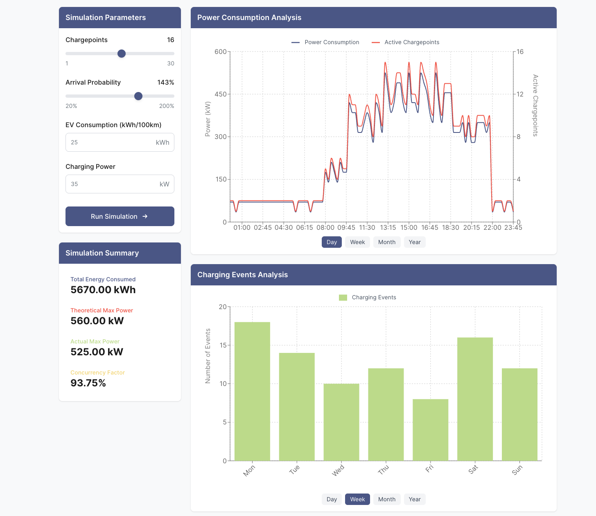

# EV Charging Simulation Frontend

A React-based visualization dashboard for electric vehicle charging simulation data. This project provides interactive visualizations of power consumption, charging events, and key metrics for EV charging infrastructure planning.

## Features

- **Interactive Simulation Controls**: Configure simulation parameters including number of chargepoints, arrival probability, EV consumption, and charging power
- **Power Consumption Visualization**: View power usage and active chargepoints throughout the day
- **Charging Events Analysis**: Analyze charging patterns across different timeframes (day/week/month/year)
- **Simulation Summary**: View key metrics including total energy consumed, theoretical and actual power demand, and concurrency factor
- **Responsive Design**: Works on desktop and mobile devices

## Screenshots



## Getting Started

### Prerequisites

- Node.js (v16+)
- npm or yarn

### Installation

1. Install dependencies:

   ```bash
   npm install
   ```

2. Start the development server:

   ```bash
   npm run dev
   ```

3. Open your browser and navigate to `http://localhost:3000`

## Project Structure

```
src/
├── components/
│   ├── charts/
│   │   ├── PowerConsumptionChart.tsx
│   │   └── ChargingEventsChart.tsx
│   ├── simulation/
│   │   ├── SimulationControls.tsx
│   │   └── SimulationSummary.tsx
│   ├── ui/
│   │   ├── Card.tsx
│   │   └── Header.tsx
│   └── Dashboard.tsx
├── services/
│   └── SimulationService.ts
├── types.ts
├── App.tsx
└── main.tsx
```

### Key Components

- **Dashboard**: Main component that orchestrates the simulation and visualizations
- **SimulationControls**: Form to configure simulation parameters
- **PowerConsumptionChart**: Visualizes power usage and active chargepoints throughout the day
- **ChargingEventsChart**: Displays charging events across different timeframes
- **SimulationService**: Connects the UI with the simulation logic - values are random and present for visualisation purposes only

## Technologies Used

- **React**: Frontend UI library
- **TypeScript**: Type-safe JavaScript
- **Tailwind CSS**: Utility-first CSS framework
- **Recharts**: Composable charting library
- **Zod**: TypeScript-first schema validation

## Implementation Details

### Simulation

The simulation is designed to model EV charging behavior at a facility with configurable parameters:

- Number of chargepoints (1-30)
- Arrival probability multiplier (20-200%)
- EV consumption rate (10-30 kWh/100km)
- Charging power (3-50 kW)

The simulation runs with 15-minute time intervals over a 24-hour period, modeling:

- EV arrivals based on time-of-day probabilities
- Charging behavior with realistic power consumption
- Concurrent usage patterns

### Visualization

The dashboard provides two main visualizations:

1. **Power Consumption Chart**: Shows power usage (kW) and active chargepoints throughout the day, with dual Y-axes for clear comparison.

2. **Charging Events Chart**: Displays the number of new charging events by time period, with options to view patterns by day, week, month, or year.

## Task Requirements

This project fulfills the requirements for Task 2a of the EV Charging Simulation project:

- Visualization of input parameters and simulation results
- Display of charging values (kW) per chargepoint
- Visualization of an exemplary day
- Presentation of total energy charged (kWh)
- Analysis of charging events over various time periods

## Integration with Task 1

The frontend is designed to integrate with the Task 1 simulation logic. To connect:

1. Import your Task 1 simulation code in `SimulationService.ts`
2. Replace the mock implementation with calls to your actual simulation functions
3. Map between UI parameters and simulation parameters
